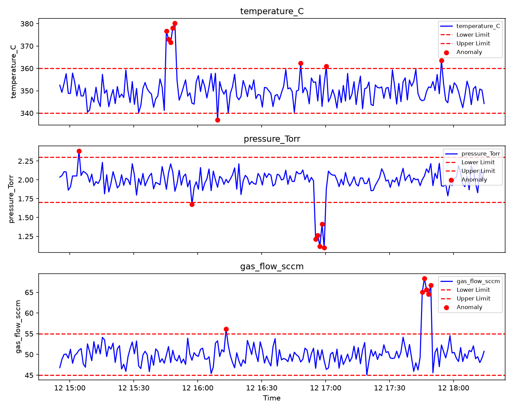

# Semiconductor Process Parameter Monitoring System

## Overview
A Python-based system that simulates real-time monitoring of critical 
fabrication process parameters (temperature, pressure, gas flow) for 
semiconductor equipment such as PECVD/furnace systems, with automated 
anomaly detection and alerting.

## Features
- Simulated real-time process parameter data generation
- Threshold-based anomaly detection for process control limits
- Automated alert logging (CSV)
- Visual dashboard showing parameter trends and flagged anomalies

## Sample Output

## Tools Used
- Python
- Pandas
- NumPy
- Matplotlib

## Files
- `generate_data.py` - generates simulated sensor/process data
- `monitor.py` - detects anomalies based on defined process limits
- `dashboard.py` - visualizes process parameters and flags anomalies
- `process_data.csv` - generated sample data
- `alerts_log.csv` - detected anomaly log
- `process_dashboard.png` - visual dashboard output

## How to Run
1. `python generate_data.py` - generates simulated process data
2. `python monitor.py` - detects anomalies and creates alert log
3. `python dashboard.py` - creates visual monitoring dashboard

## Relevance
This project demonstrates process monitoring, equipment parameter 
tracking, threshold-based anomaly detection, and troubleshooting 
approaches relevant to semiconductor fabrication facility operations 
(e.g., cleanroom equipment monitoring).
